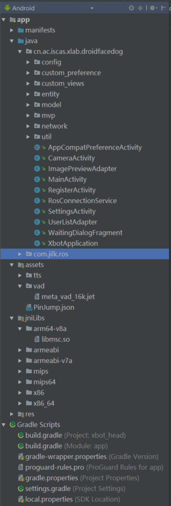
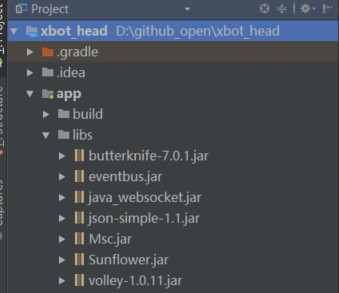

# Xbot Head 开发说明文档 

写作者  ：  [lisongting](https://github.com/lisongting)

修改日期： 2018 年 1 月 5 日

---

### 目录：

+ [项目介绍](#项目介绍)
+ [项目结构](#项目结构)
+ [代码结构](#代码结构)
+ [关键代码说明](#关键代码说明)


## 项目介绍

Xbot机器人头部可以放置一块Android平板，以提供给用户更好的交互性。Xbot Head 是运行于Xbot头部平板的Android应用，用于完成一些特定场景功能，如博物馆自动寻路解说，办公室智能人脸打卡，AI对话等。

Xbot Head的源码位于：https://github.com/lazyparser/xbot_head

Xbot Head的下载链接：http://fir.im/u4rz

开发者进行此项目开发需要预先了解一些知识点：

* [ROS](http://wiki.ros.org/ROS/) 
* [ROS Bridge](http://wiki.ros.org/rosbridge_suite)
* ROS教程推荐：
  * [中文RosWiki](http://wiki.ros.org/cn/)
  * [创客智造](http://www.ncnynl.com/)
  * [ROS-Academy-for-Beginners](https://github.com/sychaichangkun/ROS-Academy-for-Beginners) 

## 项目结构

Xbot Head项目的组成结构如下：

### 1.用户模块

Xbot Head使用优图盒子作为人脸识别服务端，关于优图盒子的说明文档在本项目的**doc** 文件夹下。使用Xbot Head时应该先启动人脸识别服务器，并在Xbot Head的设置页面中，正确设置好优图服务端的IP地址。

用户模块包含用户注册功能和查看用户列表功能：

* 用户注册：用户输入姓名，然后拍摄一张照片，即可注册到优图人脸识别服务器中。
* 查看用户列表：查看已注册到优图服务器中的用户列表，可以查看头像和姓名。

### 2.语音解说

该功能是用于在博物馆中，结合了人脸识别功能，配合Xbot机器人进行交互式解说。

[运行截图和详细描述见roswiki](http://wiki.ros.org/Robots/Xbot/tutorial/cn/Museum%20Commentary)

[博物馆解说功能的演示视频](https://v.qq.com/x/page/b0554ns4lgk.html)

### 3.人脸签到

该功能是用于在办公室内，结合人脸识别功能，配合Xbot机器人进行自动人脸签到(打卡)。

[运行截图和详细描述见roswiki](http://wiki.ros.org/Robots/Xbot/tutorial/cn/Face%20Sign%20In)

[办公室人脸打卡功能的演示视频](https://v.qq.com/x/page/c05548cj74s.html) 

### 4.综合交互模式

综合交互模式的运行流程：首先进行人脸识别(需要连接人脸识别服务器)，然后Xbot Head会发出语音问候，随后进入语音交互模式，语音交互对答是采用了科大讯飞的SDK来实现，科大讯飞提供了一些基础的语音问答库，如天气问答、常见问候语对答、讲故事、讲笑话甚至十万个为什么，等等。除了科大讯飞提供的一些基础问答库外，还可以在官网上自行创建问答条目，以完成各种场景下的对话需求。科大讯飞语音服务的使用方式参见： [科大讯飞开放平台](http://www.xfyun.cn/)

### 5.云端配置模块

云端配置模块中是用于设置ROS服务器IP地址、优图人脸识别服务器的IP地址、人脸检测阈值。

ROS服务器地址即Xbot机器人的IP地址，只有配置好ROS服务器，Xbot Head才能和机器人进行通信。

人脸检测阈值：优图人脸识别服务器在识别人脸时，会返回一个人力置信度(confidence)。当置信度大于这个设置阈值时，Xbot Head才认为人脸识别成功，否则认为人脸识别失败。默认设置为0.6 。

云端配置中还有一个设置选项为新消息通知，该选项留作后续功能扩展用(后续可能会加入通知功能)。

## 代码结构 

整个项目的代码结构如下：



下面对文件和文件夹进行大致说明，以便开发者先了解整个项目的结构。

### cn.ac.iscas.xlab.droidfacedog

该文件夹下为Xbot Head项目的主要代码。(下一个版块会对这些代码进行详细说明。)

### com.jilk.ros包 

这是一个开源的ROSBridge客户端，其源码位于：https://github.com/djilk/ROSBridgeClient  。

导入该包，可以在Java层通过RosBridge协议和ROS底层(Xbot机器人)进行交互，该开源项目把Java与ROS的通信过程进行了封装，方便开发者用Java代码与Ros底层通信。

### assets文件夹

其中tts文件夹存放了博物馆解说词音频文件，以及几个用户姓名的音频文件。

vad文件夹中的文件，是运行科大讯飞语音交互服务所需的，属于讯飞SDK的一部分。

PinJump.json：该文件是一个动画文件，是一个跳跃的指针，用于人脸签到功能中，使用了动画框架[Lottie](https://github.com/airbnb/lottie-android) 来解析该动画。

### jniLibs

其中存放了科大讯飞SDK提供的动态链接库libmsc.so。

### Jar包

使用的Jar包如下：



其中eventbus、java_websocket、json-simple-1.1是**com.jilk.ros** (RosBridgeClient)中使用到的，Msc.jar和Sunflower.jar是科大讯飞语音服务SDK的jar包。butterknife是用于把事件和控件进行绑定的框架，volley是网络请求框架。

## 关键代码说明

下面对一些关键代码说明，下面贴出的是部分代码片段，阅读下面的内容需要结合[源码](https://github.com/lazyparser/xbot_head)查看。

### 文件夹 : config 

Config.java : 该文件中存放了常量和应用的配置信息

```java
public class Config {
	//表示Ros服务器IP
    public static String ROS_SERVER_IP = "192.168.0.135";
	//ROS服务器端口 (无需改动)
    public static String ROS_SERVER_PORT = "9090";
	//优图人脸识别服务器的IP
    public static String RECOGNITION_SERVER_IP = "192.168.0.135";
	//优图人脸识别服务器端口(无需改动)
    public static String RECOGNITION_SERVER_PORT = "8000";
	//人脸检测阈值
    public static double RECOG_THRESHOLD ;
	//是否开启通知(保留字段，后续扩展用)
    public static boolean ENABLE_MESSAGE_NOTIFICATION;

    //科大讯飞命令词识别功能所需的语法文本
    public static final String SPEECH_GRAMMAR = "#ABNF 1.0 UTF-8;\n" +
            "language zh-CN;\n" +
            "mode voice;\n" +
            "root command;\n" +
            "$command = $action [$speech];\n" +
            "$action = 暂停|停止|继续|恢复|开始;\n" +
            "$speech = 解说|播放;";

    //讯飞开放平台中获得的APPID
    public static final String APPID = "59198461";

    //创建AIUIAgent所需的初始化参数
    public static final String AIAGENT_PARAMS = "{\"interact\":{\"interact_timeout\":\"60000\",\"result_timeout\":\"5000\"}," +
            "\"global\":{\"scene\":\"main\",\"clean_dialog_history\":\"auto\"}," +
            "\"vad\":{\"vad_enable\":\"1\",\"engine_type\":\"meta\",\"res_type\":\"assets\",\"res_path\":\"vad/meta_vad_16k.jet\"}," +
            "\"iat\":{\"sample_rate\":\"16000\"}," +
            "\"speech\":{\"data_source\":\"sdk\"}}";

    public static String string() {
        StringBuffer sb = new StringBuffer();
        sb.append("\n人脸识别服务端：" + RECOGNITION_SERVER_IP + ":" + RECOGNITION_SERVER_PORT);
        sb.append("\nROS服务端：" + ROS_SERVER_IP + ":" + ROS_SERVER_PORT);
        sb.append("\n阈值:" + RECOG_THRESHOLD);
        sb.append("\n开启通知：" + ENABLE_MESSAGE_NOTIFICATION);
        return sb.toString();
    }
}
```

其中，`ROS_SERVER_PORT`  和 `RECOGNITION_SERVER_PORT` 这两个值不需要更改。

### 文件夹 : custom_preference

RosIpPreference.java : 

RosIpPreference继承自`DialogPreference` ，RosIpPreference是一个自定义的Preference，用于设置界面中，输入Ros服务器IP的控件，当在输入界面弹出时，点击输入框，可以展示历史记录列表，展示历史记录的代码片段如下：

```java
 public void showHistoryList() {
        for (String str : historyArr) {
            if (str != null) {
                Map<String, String> map = new HashMap<>();
                map.put("textViewIp", str);
                historyList.add(map);
            }
        }
        simpleAdapter = new SimpleAdapter(getContext(), historyList,
                android.R.layout.simple_dropdown_item_1line,
                new String[]{"textViewIp"}, new int[]{android.R.id.text1});
        listView.setAdapter(simpleAdapter);
    }
```

当输入完IP后，点击确定键(该过程包含正则校验)，会把当前的值保存到SharedPreference里面，方便下次APP重启时进行读取。历史记录我是采用一个字符串形式拼接的，历史记录中初始包含"10.0.0.0_192.168.1.0"，如果后续输入了192.168.0.20，则历史记录字符串会是"10.0.0.0_192.168.1.0_192.168.0.20" 。

```java
//将每次输入的记录保存下来，存放在SharedPreference中
    public void writeToSharedPreference(String str) {
        //如果历史记录中已经有了相同的ip，则不添加，否则才添加到历史记录
        if (!input_history.contains(str)){
            for(int i=historyArr.length-1;i>=3;i--) {
                historyArr[i] = historyArr[i-1];
            }
            historyArr[2] = str;
            StringBuilder sb = new StringBuilder(INIT_HISTORY);
            int num = INIT_HISTORY.split("_").length;
            for(int i=num;i<historyArr.length;i++) {
                if (historyArr[i] != null) {
                    sb.append("_").append(historyArr[i]);
                }
            }
            spEdtor.putString(KEY_ROS_HISTORY, sb.toString());
        }
        spEdtor.putString(KEY_ROS_SERVER_SP, str);
        spEdtor.apply();
        Config.ROS_SERVER_IP = str;

    }
```

SeekbarPreference.java : 

SeekbarPreference继承自`Preference`类，是一个自定义Preference，用于设置界面中控制人脸检测阈值，实际上就是里面包含了一个Seekbar而已，并对Seekbar添加了事件监听器，当滑动块发生变化时，把这个变化后的数值写入到SharedPreference中。SeekbarPreference中有一个内部类`SavedState` ，由于SeekbarPreference直接继承自Preference，使用`Parcelable`来存储数据，所以需要使用一个继承自`BaseSavedState` 的类来进行数据保存。

```java
public class SeekbarPreference extends Preference implements SeekBar.OnSeekBarChangeListener{
  .............
private static class SavedState extends BaseSavedState {
        int savedProgress;
        public SavedState(Parcel source) {
            super(source);
            savedProgress = source.readInt();
        }
        @Override
        public void writeToParcel(Parcel dest, int flags) {
            super.writeToParcel(dest, flags);
            dest.writeInt(SeekbarPreference.progress);
        }
        public SavedState(Parcelable superState) {
            super(superState);
        }
        public static final Parcelable.Creator<SavedState> CREATOR =
                new Parcelable.Creator<SavedState>() {
                    public SavedState createFromParcel(Parcel in) {
                        return new SavedState(in);
                    }

                    public SavedState[] newArray(int size) {
                        return new SavedState[size];
                    }
                };
   }
}
```

重写Preference的`onSaveInstanceState()` 方法，然后使用`SavedState` 来写入数据。

```java
//自定义Preference使用Parcelable来存储数据的。这样下次启动该界面时才能恢复出原来设置好的值
    protected Parcelable onSaveInstanceState() {
        final Parcelable superState = super.onSaveInstanceState();
        if (isPersistent()) {
            return superState;
        }
        final SavedState myState = new SavedState(superState);
        myState.savedProgress = progress;
        return myState;
    }
```

YoutuIpPreference.java :`YoutuIpPreference` 和`RosIpPreference` 的性质是一样的，都是用来保存IP地址，两者代码大致类似，这里不再赘述。

### 文件夹 : custom_views 

该文件夹下主要是一些自定义View。

CircleRotateView.java :

CircleRotateView是App启动时对话框中的等待动画，等待Ros服务器连接。其`onDraw()` 方法如下：

```java
@Override
    public void onDraw(Canvas canvas) {
        super.onDraw(canvas);

        canvas.save();
        canvas.translate(mWidth / 2, mHeight / 2);
        mPaint.setColor(circleColor);
        mPaint.setStyle(Paint.Style.FILL);
        canvas.drawCircle(0, 0, radius, mPaint);
        mPaint.setColor(circleColor2);
        canvas.drawCircle(0,0,radius*0.6F,mPaint);
        canvas.rotate(degree);
        mPaint.setStyle(Paint.Style.STROKE);
        mPaint.setStrokeWidth(strokeWidth);
        mPaint.setColor(outColor);
        canvas.drawArc(rectF, 50, 80, false, mPaint);
        canvas.drawArc(rectF, -130, 80, false, mPaint);
        //恢复为原来的位置
        canvas.restore();

        canvas.save();
        canvas.translate(mWidth / 2, mHeight / 2);
        canvas.rotate(-degree);
        mPaint.setColor(outColor2);
        mPaint.setStyle(Paint.Style.STROKE);

        canvas.drawArc(outerRectF, -50, 100, false, mPaint);
        canvas.drawArc(outerRectF,130,100,false,mPaint);
        canvas.restore();
    }
```

这个绘制的过程实际就是不断的旋转画布，然后画弧。

开启动画部分的代码：

```java
public void startAnimation() {
        radius = mHeight / 4;
        degree = 0;
        radiusAnimator = ValueAnimator.ofFloat(mHeight / 4, mHeight / 8, mHeight / 4);
        radiusAnimator.addUpdateListener(new ValueAnimator.AnimatorUpdateListener() {
            @Override
            public void onAnimationUpdate(ValueAnimator animation) {
                radius = (float) animation.getAnimatedValue();
                rectF = new RectF(-radius * 4 / 3, -radius * 4 / 3, radius * 4 / 3, radius * 4 / 3);
                outerRectF = new RectF(-radius * 5/ 3, -radius * 5 / 3, radius * 5 / 3, radius * 5 / 3);
                postInvalidate();
            }
        });
        radiusAnimator.setRepeatCount(ValueAnimator.INFINITE);
        radiusAnimator.setDuration(3000);
        radiusAnimator.start();
        degreeAnimator = ValueAnimator.ofFloat(0, 360);
        degreeAnimator.addUpdateListener(new ValueAnimator.AnimatorUpdateListener() {
            @Override
            public void onAnimationUpdate(ValueAnimator animation) {
                degree = (float) animation.getAnimatedValue();
                postInvalidate();
            }
        });
        degreeAnimator.setRepeatCount(ValueAnimator.INFINITE);
        degreeAnimator.setDuration(1500);
        degreeAnimator.start();
    }
```

创建了两个属性动画，一个用来控制半径的变化，一个用来控制旋转角度的变化。

FaceOverlayView.java :

该自定义View是用于在人脸检测时，对检测到的人脸，绘制一个人脸区域矩形框。人脸数据由`setFaces()` 传入，传入后调用`invalidate()` 进行重绘。

WaveView.java : 

该类是一个具有波纹效果的按钮，用于综合交互模式中。

综合交互界面如下，左上角的按钮是WaveView的效果：


WaveView的`onDraw()` 方法：

```java
 @Override
    public void onDraw(Canvas canvas) {
        mPaint.setStyle(Paint.Style.FILL);
        mPaint.setColor(mColor);
        mPaint.setAlpha(255);
        if (isClickable()) {
            mPaint.setShader(shader);
        } else {
            mPaint.setShader(disableShader);
        }
        canvas.drawCircle(mWidth / 2, mHeight / 2, mRadius, mPaint);
        mPaint.setColor(Color.WHITE);
        mPaint.setTextSize(40);
        mPaint.setShader(null);
        if (!isWorking) {
            canvas.drawText(strStart, centerX - mPaint.measureText(strStart) / 2, centerY + textHeight / 2, mPaint);
        } else {
            canvas.drawText(strStop, centerX - mPaint.measureText(strStop) / 2, centerY + textHeight / 2, mPaint);
        }
        mPaint.setStyle(Paint.Style.STROKE);
        mPaint.setStrokeWidth(2);
        mPaint.setColor(Color.GREEN);
        mPaint.setAlpha(outCircleAlpha);
        canvas.drawCircle(centerX,centerY,outCircleRadius,mPaint);
        canvas.drawCircle(centerX,centerY,outCircleRadius*accelerate,mPaint);

    }
```

其绘制过程代码比较简单，就是绘制Circle和Text。

### 文件夹 : entity

该文件夹下主要是一些实体类。

**AIMessage.java**  : 在语音对话功能中，用户每说的一句话就会被录音，然后上传到科大讯飞的服务器，科大讯飞会返回json响应数据。当我说一句"你是谁"，科大讯飞返回的json响应如下：

```
 {"sid":"cid6f1877c2@ch00b00cd64625040001","operation":"ANSWER","text":"你是谁","service":"chat","man_intv":"","answer":{"topic":"chat_aiui个性化_你是谁","text":"我就是我，是颜色不一样的烟火。", "answerType":"qa","topicID":"2147911","question":{"ws":"你 是 谁","q":"你是谁"},"type":"T","isCustomized":"","emotion":"neutral"},"uuid":"atn002a8d20@un46360cd646256f2601","rc":0,"no_nlu_result":0}
```

AIMessage是该json对应的实体类。

这是2017年7月底得到的数据，科大讯飞可能会更新后台服务，开发者在开发此项目时，如果返回数据不一样，可以灵活处理，或者根据返回的json新创建一个实体类。

**AudioStatus.java**  : 该类用来描述当前媒体播放器的播放情况（语音解说时，媒体播放器会播放解说词），该类只有两个成员，`id` 表示当前正在播放的解说词音频的id，`isComplete` 表示当前的播放状态，正在播放时，`isComplete` 为`false` ，当播放完一小段解说词时，`isComplete` 为`true` 。

**CommandRecogResult.java** : 科大讯飞指令词识别的响应实体类。一开始开发指令词识别是想用语音控制解说词的播放和停止，比如我说"开始播放"，经过指令词识别之后，Xbot Head开始播放解说词；我说"停止播放" ,Xbot Head 则停止播放解说词。后来经过实际测试，指令词识别不太可靠，因为会涉及到语音冲突问题，指令词是通过录音录入的，而当说出指令词时，设备同时是在播放解说词，设备就会把解说词也录进去，从而加大了识别失败的概率。这里还是对CommandRecogResult进行一下说明，CommandRecogResult类有四个成员，`sn` 是sentence的缩写，表示第几句；`ls` 是lastSentence的缩写，表示是否是最后一句；`bg` 是begin的缩写，代表是否是开始的语句。`ed` 是end的缩写，代表结束标志；`ws`是一个列表，里面存放的是指令词。

**FaceResult.java** : 当进行人脸识别时，FaceResult代表了当前摄像头拍摄到的人脸信息，FaceResult有五个成员变量，`PointF midEye` 是一个点，表示眼睛连线的中点，`float eyeDist` 表示人眼之间的距离，`confidence` 表示人脸的置信度，`pose` 表示人脸在Y轴的Euler angle(欧拉角)，pose反映了人脸在Y轴的倾斜程度，这个成员不重要，只是作为参考值。`id` 表示人脸编号，`time` 是当前的时间戳。

**MuseumPosition.java** ：MuseumPosition是用于博物馆解说场景，用来描述当前Xbot机器人所处的位置。软件所博物馆被划分成若干各区域，当Xbot到达每一个区域时，就通知Xbot Head播放对应区域的解说音频。该类有两个成员变量，`locationId` 表示区域ID，`isMoving` 表示当前Xbot是否在移动。

**PublishEvent.java** : 这个类是**com.jilk.ros** 包中依赖的类，是作为Ros的消息封装类。

```java
public class PublishEvent {
    public String msg;
    public String id;
    public String name;
    public String op;
    public PublishEvent(Operation operation,String name, String content) {
        if(operation != null) {
            id = operation.id;
            op = operation.op;
        }
        this.name = name;
        msg = content;
    }
    public String toString() {
        return "{msg: '" + msg + "', id: '" + id + "', name: '"
                + name + "', op: '" + op + "'}";
    }
}
```

PublishEvent可以看做是Ros通信的消息载体。其中msg为消息，比如Xbot Head 订阅了某个topic之后，ros服务器发回来的数据，是以json字符串形式存放在msg中。`name` 为topic名称，`op` 表示操作，如果是订阅则op为"subscribe" ，如果是发布操作则op为"publish"，其他的操作也是由一个字符串表示，依次类推，`id` 为`Operation` 中的id，表示操作的标识符。

**RobotStatus.java** : 该类也是用于描述机器人状态，和上面的MuseumPosition类似，不同之处是使用场景不同，RobotStatus是用于办公室人脸签到场景，MuseumPosition用于博物馆解说场景。RobotStatus也有两个成员变量，一个是`locationId`，用来表示Xbot所处的位置，一个是`isMoving` 用来表示机器人是否在移动。既然RobotStatus和MuseumPosition这么相似，为什么不改为使用同一个类呢？原因是博物馆解说和办公室人脸打卡是两个不同的业务逻辑，在人脸打卡模式，Xbot到达第一个指定点后，会把第一个点作为起始点，然后自动前往第二个点，Xbot到达每一个点时会在Xbot Head上进行相应的界面更新，而在博物馆解说模式，Xbot到达第一个指定点之后，会停下来，进行人脸识别，识别后才出发前往第二个点。所以Xbot Head需要订阅不同的topic来接收两种不同的业务下的状态信息(这一点我会在人脸打卡模块和博物馆解说模块再详细解释)

**SignStatus.java** : 该类是用在人脸签到功能，用来描述Xbot Head是否人脸识别完成，其有两个字段，`isComplete` 表示是否识别完成，`isRecogSuccess` 表示是否识别出是**已注册用户** ，如果一个未注册的用户进行识别，尽管可以检测到人脸，但`isRecogSuccess`值应该设为false。 

**UserInfo.java** : 用来描述用户信息，这个类用在**查看用户注册列表** 功能中，Xbot Head会查询优图人脸识别服务器的所有注册用户id，然后根据这些id，再去查询获取这些用户的人脸图像。UserInfo包含两个成员变量，`name` 表示用户姓名，`face` 表示人脸图像。


### 文件夹 : model 

model 文件夹中存放了一些逻辑模块，有如下几个文件。

**AiTalkModel.java** 

该类是AI对话模块的封装，其中使用了科大讯飞的AI对话服务和TTS(Text To Speech)服务，关于AI对话和TTS功能的使用方式，请阅读**doc** 文件夹中的附件，或到科大讯飞官方网站下载阅读最新说明文档。下面我对一些关键代码进行说明。

在初始化的时候，有如下代码：

```java
//创建 SpeechSynthesizer 对象, 第二个参数：本地合成时传 InitListener，可以为Null
ttsSynthesizer = SpeechSynthesizer.createSynthesizer(context, null);

 //xiaoyan：青年女声-普通话  xiaoyu：青年男声-普通话   vixx：小男孩-普通话    vinn：小女孩-普通话
ttsSynthesizer.setParameter(SpeechConstant.VOICE_NAME, "vinn"); //设置发音人
ttsSynthesizer.setParameter(SpeechConstant.SPEED, "50");//设置语速
ttsSynthesizer.setParameter(SpeechConstant.VOLUME, "80");//设置音量，范围 0~100
ttsSynthesizer.setParameter(SpeechConstant.ENGINE_TYPE, SpeechConstant.TYPE_CLOUD); //设置云端
.....
agent = AIUIAgent.createAgent(context, Config.AIAGENT_PARAMS, aiuiListener);
```

ttsSynthesizer是一个语音合成器，其类型是`SpeechSynthesizer`，用于把文字合成为语音播放出来，ttsSynthesizer可以设置各种参数，包括设置发音人、语速、音量等，设置云端表示使用在线的语音合成服务(这就要求设备必须联网)。agent是一个`AIUIAgent` ，用来进行AI对话服务。当用户说话时，AIUIAgent会对说话内容录音，然后发送到讯飞服务器，服务器返回给我响应，即上面介绍的响应实体类**AIMessage** ，这个AIMessage中包含对话的文字信息，有了这些文字信息之后，再使用ttsSynthesizer将文字转化为语音播放出来，从而实现AI对话的功能。

开启AI对话的代码如下：

```java
public void startAiTalk(OnAiTalkerResult callbackMessage,OnAiTalkerTimeout callback) {
        isChatMode = true;
        if (callbackMessage!=null) {
            this.talkerCallback = callbackMessage;
        }
        if (callback != null) {
            this.timeoutCallback = callback;
        }
        //唤醒AIUIAgent
        AIUIMessage wakeupMsg = new AIUIMessage(AIUIConstant.CMD_WAKEUP, 0, 0, "", null);
        agent.sendMessage(wakeupMsg);
        //开始录音
        String param = "sample_rate=16000,data_type=audio";
        AIUIMessage audioMessage = new AIUIMessage(AIUIConstant.CMD_START_RECORD, 0, 0, param, null);
        agent.sendMessage(audioMessage);
        lastWakeUpTime = System.currentTimeMillis();
        //启动超时检测
        startAutoCloseTask();
        isRecording = true;
    }
```

`AIUIAgent` 首先需要进行唤醒，然后才能开始录音，录音是调用`sendMessage()` 函数的形式，将参数放置在AIUIMessage中。

将文字转换为语音的代码如下：

```java
 //使用TTS引擎将AI对话的结果以语音形式播放出来
   public void speakOutResult(String str) {
        log("Speak Out:" + str);
        if (str.equals("好的，接下来开始播放解说词")) {
            ttsSynthesizer.startSpeaking(str,synthesizerListener );
            try {
                Thread.sleep(4200);
            } catch (InterruptedException e) {
                e.printStackTrace();
            }
        }else{
            //设置声音文件的缓存。仅支持保存为 pcm 和 wav 格式
            String cacheFileName = context.getExternalCacheDir() + "/" + str + ".pcm";
            //如果本地已经有离线缓存，则直接播放离线缓存文件
            if (isCacheExist(cacheFileName)) {
                ttsSynthesizer.setParameter(ResourceUtil.TTS_RES_PATH, cacheFileName);
                ttsSynthesizer.startSpeaking(str,synthesizerListener);
                Log.i(TAG, "播放离线缓存文件");
            } else {
                //如果本地没有缓存，则播放在线数据的同时缓存到本地
                ttsSynthesizer.setParameter(SpeechConstant.TTS_AUDIO_PATH, cacheFileName);
                //开始播放
                ttsSynthesizer.startSpeaking(str,synthesizerListener );
                Log.i(TAG, "离线文件不存在,在线播放");
            }
        }
    }
```


**AudioManager.java** 

该类 用来管理所有解说词音频文件，通过`loadTts()` 函数导入了所有在assets文件夹中的音频：

```java
 public void loadTts() {
        new Thread() {
            public void run(){
                for(int i = 0; i < ttsFileList.length; i++) {
                    try {
                        AssetFileDescriptor afd = context.getAssets().openFd(ttsFileList[i]);
                        MediaPlayer mp = new MediaPlayer();
                        mp.setDataSource(afd.getFileDescriptor(), afd.getStartOffset(), afd.getLength());
                        mp.prepare();
                        Log.i(TAG, "Loading ttsList[" + Integer.toString(i) + "]");
                        mp.setOnCompletionListener(new MediaPlayer.OnCompletionListener() {
                            @Override
                            public void onCompletion(MediaPlayer mp) {
                                isPlaying = false;
                                currentId = CURRENT_NOT_PLAYING;
                            }
                        });
                        audioMap.put(i,mp);
                    } catch (IOException e) {
                        e.printStackTrace();
                    }
                }
            }
        }.start();
    }
```

并且使用了一个HashMap 来维护音频id与音频之间的一一对应关系。

 定义了一个回调接口，外部可以通过给AudioManager设置回调的方式来得知音频是否播放完成：

```java
public interface AudioCompletionCallback {
        //表示已经播放完的音频id
        void onComplete(int id);
}
```

播放时可以调用`playAsync()` 函数：

```java
 public void playAsync(int audioId, final AudioCompletionCallback completionCallback) {
        Log.i(TAG, "AudioManager在播放：" + audioId + "号音频");
        currentPlayer = audioMap.get(audioId);
        currentPlayer.start();
        isPlaying = true;
        currentId = audioId;

        currentPlayer.setOnCompletionListener(new MediaPlayer.OnCompletionListener() {
            @Override
            public void onCompletion(MediaPlayer mp) {
                completionCallback.onComplete(currentId);
            }
        });
    }
```

这样，当解说词播放完时，在回调函数中，就可以通知Xbot前往下一个解说点了。

**TTSModel.java** 

TTSModel是科大讯飞TTS引擎的封装类，用于将文字转换成声音，主要用于对用户进行问候。其中关键代码如下

```java
public interface OnTTSFinishListener {
        void onTTSFinish(SpeechError speechError);
 }
......
//userId是优图服务器返回的16进制字符串
public void speakUserName(String userId,OnTTSFinishListener listener) {
        this.onTTSFinishListener = listener;
        StringBuilder text = new StringBuilder();
        text.append("你好，");
        if (userId.length()==0) {
            text.append("游客,");
        } else {
            String name = Util.hexStringToString(userId);
            text.append(name).append(",");
        }
        text.append("我是语音机器人，你有什么想对我说的吗");
        //设置声音文件的缓存。仅支持保存为 pcm 和 wav 格式
        String cacheFileName = context.getExternalCacheDir() + "/" + userId + ".pcm";
        //如果本地已经有离线缓存，则直接播放离线缓存文件
        if (isCacheExist(cacheFileName)) {
            ttsSynthesizer.setParameter(ResourceUtil.TTS_RES_PATH, cacheFileName);
            ttsSynthesizer.startSpeaking(text.toString(),synthesizerListener);
            Log.i(TAG, "播放离线缓存文件");
        } else {
            //如果本地没有缓存，则播放在线数据的同时缓存到本地
            ttsSynthesizer.setParameter(SpeechConstant.TTS_AUDIO_PATH, cacheFileName);
            //开始播放
            ttsSynthesizer.startSpeaking(text.toString(),synthesizerListener );
            Log.i(TAG, "离线文件不存在,在线播放");
        }
        Log.i(TAG, "greetToUser:" + text.toString());
}
```

TTSModel类主要用在综合交互模式中，当识别出用户的时候，进行问候，"你好，xxx，我是语音机器人，你有什么想对我说的吗"。如果没有识别出用户或识别失败，则问候语为"你好，游客，我是语音机器人，你有什么想对我说的吗"。播放时会检查离线缓存是否存在，如果存在则播放离线缓存，如果不存在则在线播放，同时缓存到本地。

### 文件夹 : network 

先对network和util目录下的文件进行说明，然后对**droidfacedog** 中的外层文件进行说明，mvp目录最后进行说明。

network文件夹中包含如下文件：

**VolleySingleton.java**  : 单例模式，用于网络请求。

```java
public class VolleySingleton {
    private static VolleySingleton volleySingleton;
    private RequestQueue requestQueue;
    private VolleySingleton(Context context){
        requestQueue = Volley.newRequestQueue(context);
    }
    public static synchronized VolleySingleton getVolleySingleton(Context context){
        if (volleySingleton == null) {
            volleySingleton = new VolleySingleton(context);
        }
        return volleySingleton;
    }
    public RequestQueue getRequestQueue(){
        return requestQueue;
    }
    public <T> void addToRequestQueue(Request<T> req){
        getRequestQueue().add(req);
    }
}
```

**YoutuConnection.java** 

该类封装了与优图服务器的交互操作，包括用户注册，人脸识别，查询用户人脸图像，查询用户列表。

注册用户的代码如下：

```java
//注册用户
    public void registerFace(String userName,Bitmap face) {
        final String REGISTER_URL = "http://"+Config.RECOGNITION_SERVER_IP+":"+
                Config.RECOGNITION_SERVER_PORT+"/management/register?method=force";
        //用户姓名需要转换成十六进制字符串形式
        final String userNameHex = Util.makeUserNameToHex(userName);
        //人脸图片需要转换为base64字符串形式
        final String encodedBitmap = ImageUtils.encodeBitmapToBase64(face, Bitmap.CompressFormat.JPEG, 100);
        new Thread(){
            public void run() {
                //请求成功的回调
                Response.Listener<JSONObject> rightListener = new Response.Listener<JSONObject>() {
                    @Override
                    public void onResponse(JSONObject jsonObject) {
                        Message msg = handler.obtainMessage();
                        try {
                            int ret = jsonObject.getInt("Ret");
                            Log.i(TAG, "register result code :" + ret);
                            if (ret == 0) {
                                msg.what = CameraActivity.REGISTER_SUCCESS;
                            } else if (ret == 1) {
                                msg.what = CameraActivity.REGISTER_TIMEOUT;
                            } else if (ret == 14) {
                                msg.what =CameraActivity.REGISTER_ALREADY_EXIST;
                            } else if (ret == 11) {
                                msg.what = CameraActivity.REGISTER_PIC_TOO_LARGE;
                            } else if(ret == 9){
                                msg.what = CameraActivity.REGISTER_HAS_NO_FACE;
                            }else {
                                msg.what = CameraActivity.REGISTER_FAIL;
                            }

                        } catch (JSONException e) {
                            e.printStackTrace();
                        }
                        handler.sendMessage(msg);
                    }
                };
                //请求失败的回调
                Response.ErrorListener errorListener = new Response.ErrorListener(){

                    @Override
                    public void onErrorResponse(VolleyError volleyError) {
                        Log.i(TAG,"Register  Error:"+volleyError.getMessage());
                        Message msg = handler.obtainMessage();
                        msg.what = CameraActivity.REGISTER_TIMEOUT;
                        handler.sendMessage(msg);
                    }
                };
                //post的参数
                JSONObject postParams = new JSONObject();
                try {
                    postParams.put("Userid", userNameHex);
                    postParams.put("Image", encodedBitmap);
                } catch (JSONException e) {
                    e.printStackTrace();
                }
                JsonObjectRequest jsonObjectRequest = new JsonObjectRequest(
                        Request.Method.POST,
                        REGISTER_URL,
                        postParams,
                        rightListener,
                        errorListener);

                VolleySingleton.getVolleySingleton(context).addToRequestQueue(jsonObjectRequest);
            }
        }.start();

    }
```

需要提供一个`Handler` 来完成交互操作，所有的注册结果需要通过handler来发回给原来的调用者。

人脸识别我采用的是回调方式，代码如下

```java
 public interface RecognitionCallback{

        void onResponse(String personId);

        void onFailure(String errorInfo);
}
.....
//以回调的方式返回结果给调用者
public void recognizeFace(Bitmap faceBitmap, final RecognitionCallback callback){

        final String RECOG_SERVER_URL = "http://" + Config.RECOGNITION_SERVER_IP + ":" +
                Config.RECOGNITION_SERVER_PORT + "/recognition";
        final String encodedBitmap = ImageUtils.encodeBitmapToBase64(faceBitmap, Bitmap.CompressFormat.JPEG, 100);
        new Thread(){
            public void run(){
                //请求成功的回调
                Response.Listener<JSONObject> rightListener = new Response.Listener<JSONObject>() {
                    @Override
                    public void onResponse(JSONObject jsonObject) {
                        Log.i(TAG,"Recognition Right Response:"+jsonObject);
                        try {
                            double confidence = jsonObject.getDouble("Confidence");
                            String userId = jsonObject.getString("Id");
                            int ret = jsonObject.getInt("Ret");
                            //判断Ret字段是否是0,如果是0表示识别成功
                            if (ret == 0 && confidence>=RECOG_THRESHOLD) {
                                callback.onResponse(userId);
                                Log.i(TAG, "识别成功");
                            }else {
                                Log.i(TAG, "人脸识别失败或阈值设置过高");
                                //如果没有识别成功，则返回空串
                                callback.onResponse("");
                            }
                        } catch (JSONException e) {
                            e.printStackTrace();
                        }

                    }
                };

                //请求失败的回调
                Response.ErrorListener errorListener = new Response.ErrorListener() {
                    @Override
                    public void onErrorResponse(VolleyError volleyError) {
                        callback.onFailure(volleyError.getMessage());
                    }
                };

                //post的参数
                JSONObject jsonObject = new JSONObject();
                try {
                    jsonObject.accumulate("Image",encodedBitmap);
                } catch (JSONException e) {
                    e.printStackTrace();
                }

                JsonObjectRequest jsonObjectRequest = new JsonObjectRequest(
                        Request.Method.POST,
                        RECOG_SERVER_URL,
                        jsonObject,
                        rightListener,
                        errorListener
                );
                VolleySingleton.getVolleySingleton(context).addToRequestQueue(jsonObjectRequest);
            }
        }.start();

}
```

网络请求部分的代码都很基础，其他函数不再赘述。

### 文件夹 : util

该目录下存放的主要是一些工具类。

**ImageUtils.java**  

 对图像的处理工具类，其中函数的作用大多可以通过函数名分辨出来，还有几个函数我要说明一下

```java
//人脸检测时，返回一个区域，用来大致描述人脸的位置
public static RectF getPreviewFaceRectF(PointF pointF,float eyeDistance) {
    return new RectF(
           (int) (pointF.x - eyeDistance * 1.20f),
           (int) (pointF.y - eyeDistance * 1.7f),
           (int) (pointF.x + eyeDistance * 1.20f),
           (int) (pointF.y + eyeDistance * 1.9f));
}
//返回一个RectF，用来检测当前人脸的移动位置是否过大，如果移动位置过大，则不捕捉人脸图像
public static RectF getCheckFaceRectF(PointF pointF, float eyeDistance) {
    return new RectF(
           (pointF.x - eyeDistance * 1.5f),
           (pointF.y - eyeDistance * 1.9f),
           (pointF.x + eyeDistance * 1.5f),
           (pointF.y + eyeDistance * 2.2f));
}
//得到一个人脸区域的范围，然后通过FaceOverlay绘制绿色矩形框 
public static RectF getDrawFaceRectF(PointF mid,float eyesDis,float scaleX,float scaleY) {
    return new RectF(
           (mid.x - eyesDis * 1.1f) * scaleX,
           (mid.y - eyesDis * 1.3f) * scaleY,
           (mid.x + eyesDis * 1.1f) * scaleX,
           (mid.y + eyesDis * 1.7f) * scaleY);
}
```

还有下面两个函数，`encodeBitmapToBase64`  用来将人脸Bitmap转为Base64编码，以发送给优图服务器，`decodeBase64ToBitmap` 用来将从优图服务器获取到的人脸base64 字符串解码为Bitmap，从而在界面上显示。

```java
//将人脸Bitmap转为Base64编码，以发送给优图服务器
    public static String encodeBitmapToBase64(Bitmap image, Bitmap.CompressFormat compressFormat, int quality)
    {
        ByteArrayOutputStream byteArrayOS = new ByteArrayOutputStream();
        image.compress(compressFormat, quality, byteArrayOS);
        return Base64.encodeToString(byteArrayOS.toByteArray(), Base64.DEFAULT);
    }
    //将从优图服务器获取到的base64 String解码为Bitmap
    public static Bitmap decodeBase64ToBitmap(String base64Str){
        byte[] bitmapBytes = Base64.decode(base64Str, Base64.DEFAULT);
        BitmapFactory.Options options = new BitmapFactory.Options();
        options.inJustDecodeBounds = true;
        BitmapFactory.decodeByteArray(bitmapBytes, 0, bitmapBytes.length, options);

        //获取到来自服务器的原始图像的宽高
        int width = options.outWidth;
        int height = options.outHeight;
//        options.inSampleSize = calculateInSampleSize(options,width/3,height/3);
        options.inSampleSize = 2;
        options.inJustDecodeBounds = false;

        return BitmapFactory.decodeByteArray(bitmapBytes, 0, bitmapBytes.length,options);
    }
```

**RegexCheckUtil.java** ：正则表达式校验工具类。

**Util.java** : 包含三个函数，`hexStringToString()` 用于把十六进制的字符串还原为utf-8中文名，`getPreferredPreviewSize()` 用于输入一系列`Size` 的集合，并指定图像的宽高，返回一个最合适的尺寸。`makeUserNameToHex()` 用于将中文用户名转换为十六进制字符串形式。

### 外层文件说明

**AppCompatPreferenceActivity.java** : 继承自`PreferenceActivity` ，主要是为了进行更好的适配，用于设置界面用。

**CameraActivity.java** : 

继承自`AppCompatActivity`， CameraActivity用于进行用户注册，主要功能是对用户进行拍照，然后发送给优图服务器进行注册。拍照是采用了`android.hardware.camera2` 包下的类进行实现，关于camera2的使用，[这里有详细的介绍](https://developer.android.com/reference/android/hardware/camera2/package-summary.html)。

一开始创建了一个Handler，用来在YoutuConnection中，接收用户注册的结果。

```java
 handler = new Handler(){
            @Override
            public void handleMessage(Message msg) {
                int result = msg.what;
                switch (result) {
                    case REGISTER_SUCCESS:
                        Toast.makeText(CameraActivity.this, "注册成功", Toast.LENGTH_LONG).show();
                        bt_ok.setVisibility(GONE);
                        bt_reCapture.setVisibility(GONE);
                        bt_home.setVisibility(View.VISIBLE);
                        break;
                    case REGISTER_FAIL:
                        Toast.makeText(CameraActivity.this, "注册失败,请检查服务端配置", Toast.LENGTH_SHORT).show();
                        break;
                    case REGISTER_ALREADY_EXIST:
                        Toast.makeText(CameraActivity.this, "注册失败，用户已存在", Toast.LENGTH_SHORT).show();
                        break;
                    case REGISTER_TIMEOUT:
                        Toast.makeText(CameraActivity.this, "连接超时，请确保优图服务端已开启", Toast.LENGTH_SHORT).show();
                        break;
                    case REGISTER_PIC_TOO_LARGE:
                        Toast.makeText(CameraActivity.this, "注册失败,图片尺寸过大", Toast.LENGTH_SHORT).show();
                        break;
                    case REGISTER_HAS_NO_FACE:
                        Toast.makeText(CameraActivity.this, "人脸不在图像中或人脸检测失败", Toast.LENGTH_SHORT).show();
                        break;
                    default:
                        Toast.makeText(CameraActivity.this, "注册失败,错误码:"+result, Toast.LENGTH_SHORT).show();
                        break;
                }
            }
        };
```

然后在`initCamera()` 中初始化摄像头：

```java
//初始化摄像头
    private void initCamera() {
        mCameraID = ""+CameraCharacteristics.LENS_FACING_BACK;
        WindowManager windowManager = (WindowManager) getSystemService(WINDOW_SERVICE);
        DisplayMetrics dm = new DisplayMetrics();
        windowManager.getDefaultDisplay().getMetrics(dm);
        int width = dm.widthPixels;
        int height = dm.heightPixels;
        Log.i(TAG, "DisplayMetrics width:" + width + ",height:" + height);
        mImageReader = ImageReader.newInstance(width, height, ImageFormat.JPEG, 1);
        Log.i(TAG, "ImageReader width:" + mImageReader.getWidth() + ",height:" + mImageReader.getHeight());
        mImageReader.setOnImageAvailableListener(new ImageReader.OnImageAvailableListener() {
            @Override
            public void onImageAvailable(ImageReader reader) {
                mTextureView.setVisibility(GONE);
                tv_shoot.setVisibility(GONE);
                iv_show.setVisibility(View.VISIBLE);
                linearLayout.setVisibility(View.VISIBLE);
                Image image = reader.acquireLatestImage();
                ByteBuffer buffer = image.getPlanes()[0].getBuffer();
                byte[] bytes = new byte[buffer.remaining()];
                buffer.get(bytes);
                Bitmap tmpBitmap = BitmapFactory.decodeByteArray(bytes, 0, bytes.length);

                if (tmpBitmap != null) {
                    Log.i(TAG, "Bitmap info: [width:"+tmpBitmap.getWidth() +",height:"+ tmpBitmap.getHeight()+"]");

                    //调节bitmap的尺寸大小
                    int width = tmpBitmap.getWidth();
                    int height = tmpBitmap.getHeight();
                    Matrix matrix = new Matrix();
                    if (width >= 1500 || height >= 1500) {
                        matrix.postScale(0.3F, 0.3F);
                    } else {
                        matrix.postScale(0.5F, 0.5F);
                    }
                    faceBitmap = Bitmap.createBitmap(tmpBitmap, 0, 0, width, height, matrix, true);
                    iv_show.setImageBitmap(tmpBitmap);
                    image.close();
                }
            }
        },null);

        mCameraManager = (CameraManager) getSystemService(CAMERA_SERVICE);
        try{
            if (ActivityCompat.checkSelfPermission(this, android.Manifest.permission.CAMERA)!=
            PackageManager.PERMISSION_GRANTED) {
                return;
            }
            //打开摄像头
            mCameraManager.openCamera(mCameraID,stateCallback,null);
        } catch (CameraAccessException e) {
            e.printStackTrace();
        }

    }
```

拍照时调用的是`takePicture()` :

```java
private void takePicture() {
        if (mCameraDevice == null) {
            return;
        }
        //创建Request.Builder()
        final CaptureRequest.Builder requestBuilder ;
        try{
            requestBuilder = mCameraDevice.createCaptureRequest(CameraDevice.TEMPLATE_STILL_CAPTURE);
            //将ImageReader的surface作为CaptureRequest.Builder的目标
            requestBuilder.addTarget(mImageReader.getSurface());
            // 自动对焦
            requestBuilder.set(CaptureRequest.CONTROL_AF_MODE, CaptureRequest.CONTROL_AF_MODE_CONTINUOUS_PICTURE);
            // 自动曝光
            requestBuilder.set(CaptureRequest.CONTROL_AE_MODE, CaptureRequest.CONTROL_AE_MODE_ON_AUTO_FLASH);
            requestBuilder.set(CaptureRequest.JPEG_ORIENTATION, 270);
            //拍照
            CaptureRequest mCaptureRequest = requestBuilder.build();
            mCameraCaptureSession.capture(mCaptureRequest, null, null);
        } catch (CameraAccessException e) {
            e.printStackTrace();
        }
    }
```

拍照的时候主要是使用`CaptureRequest.Builder` 来创建`CaptureRequest` ，可以对一些参数进行设置，如设置自动对焦和曝光等。

**ImagePreviewAdapter.java**  : 人脸图像预览的适配器，用于RecyclerView列表中，展示一系列人脸图像。

**MainActivity.java**  :  Xbot Head的主界面， 在MainActivity启动时会注册一个`BroadcastReceiver` ，用来接收Ros服务器的连接状态，ROS服务器的连接在`RosConnectionService` 中进行，当连接成功后会发送广播，MainActivity接收到广播后，然后把等待动画隐藏。

MainActivity启动时注册广播接收器:

```java
    private void initBroadcastReceiver() {
        receiver = new RosBroadcastReceiver(new RosBroadcastReceiver.RosCallback() {
            @Override
            public void onSuccess() {
                if (waitingDialogFragment.isVisible()) {
                    circleRotateView.endAnimation();
                    waitingDialogFragment.dismiss();
                }
                Toast.makeText(getApplicationContext(), "Ros服务器连接成功", Toast.LENGTH_SHORT).show();
            }
            @Override
            public void onFailure() {
            }
        });
        IntentFilter filter = new IntentFilter(ROS_RECEIVER_INTENTFILTER);
        registerReceiver(receiver,filter);
    }
```

MainActivity中还会对从`SharedPreference` 中读取所有之前的设置，如Ros服务器和优图服务器的IP地址，以及人脸检测阈值等。

```java
 //在该函数中，获取settings中设置的所有属性值，并将相关的值存放在Config中
    public void initConfiguration() {
        Resources res = getResources();
        SharedPreferences sharedPreference = PreferenceManager.getDefaultSharedPreferences(this);
        int intThreshold = sharedPreference.getInt(res.getString(R.string.key_recog_threshold),60);
        Config.RECOG_THRESHOLD = (double) intThreshold / 100;
        Config.ENABLE_MESSAGE_NOTIFICATION = sharedPreference.getBoolean(res.getString(R.string.key_enable_notification),true);
        Config.ROS_SERVER_IP = sharedPreference.getString(res.getString(R.string.key_ros_server_ip), "192.168.0.135");
        Config.RECOGNITION_SERVER_IP = sharedPreference.getString(res.getString(R.string.key_recognition_server_ip), "192.168.0.135");
        Log.i(TAG, "MainActivity启动时初始化：" + Config.string());
    }
```


**RegisterActivity.java** : 是一个注册界面的Activity，用户输入姓名之后，点击按钮进行采集头像。

**RosConnectionService.java** : 继承自`Service` ，是用来连接Ros服务器并与Ros服务器通信的。它有如下几个重要常量：

```java
//在人脸签到模式中，订阅这个topic来接收Xbot的状态信息
public static final String SUBSCRIBE_ROBOT_STATUS = "/robot_status";
//在博物馆解说模式中，订阅这个topic来接收Xbot发送的状态信息
public static final String SUBSCRIBE_MUSEUM_POSITION = "/museum_pos";
//在博物馆解说模式中，发布解说词播放状态的topic名称
public static final String PUBLISH_TOPIC_AUDIO_STATUS = "/pad_audio_status";
//在人脸签到模式中，发布签到状态的topic名称
public static final String PUBLISH_TOPIC_SIGN_COMPLETION = "/pad_sign_completion";
```

RosConnectionService收到Ros服务器发回来的信息后，其`onEvent()` 方法会被调用，这是Evenbus所带来的便利。

```java
//订阅某个topic后，接收到Ros服务器返回的message，回调此方法
public void onEvent(PublishEvent event) {
        //topic的名称
        String topicName = event.name;
        Log.i(TAG, "onEvent:" + event.msg);
        //Topic为RobotStatus
        if (topicName.equals(SUBSCRIBE_ROBOT_STATUS)) {
            String msg = event.msg;
            JSONObject msgInfo;
            try {
                msgInfo = new JSONObject(msg);
                int id = msgInfo.getInt("id");
                boolean isMoving = msgInfo.getBoolean("ismoving");
                RobotStatus robotStatus = new RobotStatus(id, isMoving);
                EventBus.getDefault().post(robotStatus);

            } catch (JSONException e) {
                e.printStackTrace();
            }
        } else if (topicName.equals(SUBSCRIBE_MUSEUM_POSITION)) {
            String msg = event.msg;
            try {
                JSONObject msgInfo = new JSONObject(msg);
                int id = msgInfo.getInt("id");
                boolean isMoving = msgInfo.getBoolean("ismoving");
                EventBus.getDefault().post(new MuseumPosition(id, isMoving));
            } catch (JSONException e) {
                e.printStackTrace();
            }
        }
}
```

当收到ros服务器发来的消息，其topic名称为`/robot_status`  时，从`msg` 字段中解析出当前区域id和`isMoving` ，然后创建一个RobotStatus   ,随后调用了 `EventBus.getDefault().post(robotStatus)` ,这里使用Eventbus Post了这个`robotStatus` ，在人脸签到模式下，SignInPresenter中的`void onEvent(RobotStatus status)` 就会触发，从而SignInPresenter可以对接收到的机器人状态进行处理，如改变UI界面，进行人脸打卡等。

相同的，当收到topic名称为`/museum_pos`  时，同样解析出id和isMoving，调用`EventBus.getDefault().post(new MuseumPosition(id, isMoving));` 将这个`MuseumPosition` 发送出去，在CommentaryPresenter中的`public void onEvent(MuseumPosition position) ` 方法就会触发，从而对收到的机器人状态进行处理，如播放解说词，改变UI界面等。

经过上面的分析，也就解答了之前在说明**RobotStatus.java** 文件夹留下的疑问 ： 既然MuseumPosition和RobotStatus都包含相同的成员变量，却还要分成两个类？因为Eventbus需要把这两个场景下的实体类分别post到不同的回调函数处理。

在`RosConnectionService` 内还有一个内部类，`ServiceBinder` ，继承自Binder，ServiceBinder有如下方法：

```java
//用来判断当前App是否与Ros服务端连接成功
public boolean isConnected()
//发布SignStatus 消息
public void publishSignStatus(SignStatus signStatus)
//发布audioStatus消息
public void publishAudioStatus(AudioStatus audioStatus)
//订阅某个topic或者取消订阅某个topic
public void manipulateTopic(String topic, boolean isSubscribe) 
//与Ros服务器断开连接
public void disConnect()
```

外部通过持有ServiceBinder的引用，来完成与Ros服务器的交互。

**SettingsActivity.java** ：集成自`AppCompatPreferenceActivity`，用于设置界面，代码比较简单。

**UserListAdapter.java** : 查看用于列表我使用的是`RecyclerView` ，UserListAdapter是RecyclerView的适配器。

**WaitingDialogFragment.java** ：用来存放启动时等待动画的Fragment，集成自`DialogFragment` 。

**XbotApplication.java** : Xbot Head应用程序的Application ，其`onCreate()` 方法如下：

```java
public void onCreate() {
        super.onCreate();
        Log.i(TAG, "XbotApplication -- onCreate()");
        initSophix();
        //创建ServiceConnection对象
        mServiceConnection = new ServiceConnection() {
            @Override
            public void onServiceConnected(ComponentName name, IBinder service) {
                Log.i(TAG, "mServiceConnection--onServiceConnected()");
                mServiceProxy = (RosConnectionService.ServiceBinder) service;
            }

            @Override
            public void onServiceDisconnected(ComponentName name) {
                Log.i(TAG, "mServiceConnection--onServiceDisconnected()");
            }
        };
        //绑定RosConnectionService
        intent = new Intent(this, RosConnectionService.class);
        //startService(intent);
        bindService(intent, mServiceConnection, BIND_AUTO_CREATE);
        //初始化讯飞TTS引擎
        SpeechUtility.createUtility(this, SpeechConstant.APPID +"="+ Config.APPID);

    }
```

在`onCreate`中，首先初始化阿里巴巴热修复引擎Sophix，具体用法可参照[阿里云官网](https://www.aliyun.com/) ，然后创建ServiceConnection对象，并使用`bindService` 的方式启动`RosConnectionService` 。最后初始讯飞TTS引擎。


### 文件夹 : mvp

mvp目录下的功能模块采用了Google的[MVP架构](https://github.com/googlesamples/android-architecture) 。

基础接口  BaseView.java :

```java
public interface BaseView<T> {
    void initView();
    void setPresenter(T presenter);
}
```

基础接口   BasePresenter.java

```java
public interface BasePresenter{
    void start();
}
```

#### 文件夹:userlist 

**UsetListContract.java** 

```java
public interface UserListContract {
    interface View extends BaseView<Presenter> {
        void showUserInList(UserInfo info);
        void showError();
    }
    interface Presenter extends BasePresenter {
        void requestUserData();
    }
}
```

**UserListActivity.java**  : 该类继承自`AppCompatActivity` ，实现`UserListContract.View` 接口，用来展示用户列表，代码部分都很简单。

**UserListPresenter.java** : 该类主要是持有`YoutuConnection` 的引用，然后使用`YoutuConnection` 发起请求，从优图服务器获取用户姓名和头像。

#### 文件夹:commentary 

该目录下的文件都是与解说模式相关的。

**CommentaryContract.java** ：描述了解说模式的View需要实现的方法和Presenter需要实现的方法。

```java
public class CommentaryContract {
    public static final int STATE_IDLE = 0;//待机状态
    public static final int STATE_DETECTED = 1;//人脸检测完毕
    public static final int STATE_IDENTIFIED = 2;//人脸识别成功
    interface Presenter extends BasePresenter {
        void recognize(Bitmap bitmap);
        void releaseMemory();
        void setServiceProxy(@NonNull Binder binder);
    }
    interface View extends BaseView<Presenter> {
        void startCamera();
        void closeCamera();
        void displayInfo(String str);
        void changeUiState(int state);
    }
}
```

**CommentaryPresenter.java** : 该类的核心代码是`onEvent()` 函数

```java
public void onEvent(MuseumPosition position) {
        int id = position.getLocationId();
        if (id == 0) {
            if (!isRobotStared) {
                view.startCamera();
                isRobotStared = true;
            } else {
                view.changeUiState(CommentaryContract.STATE_IDLE);
                //表示走完一圈又回到出发点
                isRobotStared = false;
            }
        } else if (id > 0) {
            audioManager.playAsync(id - 1, new AudioManager.AudioCompletionCallback() {
                @Override
                public void onComplete(int id) {
                    serviceBinder.publishAudioStatus(new AudioStatus(id, true));
                }
            });
        }
    }
```

解说模式下，当收到`RosConnectionService` 发来的MuseumPosition，回调`onEvent` 函数，如果当前区域id为0，则进人脸识别，识别后前往下一个解说点进行解说。如果解说完后，走完一圈回到原点，则改变UI状态为初始状态。

**CommentaryFragment.java** :继承自`Fragment` ， 该CommentaryFragment中的代码大部分是进行人脸识别和进行UI界面展示的，在人脸识别时，开启摄像头，并启动了一个线程进行人脸识别，定时将人脸图像发送给优图服务器进行人脸识别。

**CommenteryActivity.java** : 继承自`AppCompatActivity` ，是CommentaryFragment的"容器"，用来存放Fragment，代码比较简单。


#### 文件夹  : facesign 

该目录下的文件都是和人脸签到模式相关的。

**SignInContract..java** : 描述了人脸签到模式的View需要实现的方法和Presenter需要实现的方法。

```java
public interface SignInContract {
    //表示当前是准备就绪状态
    int UI_STATE_READY = 11;
    //表示当前Xbot正在前往下一个目标点的路上
    int UI_STATE_ON_THE_WAY = 22;
    interface Presenter extends BasePresenter{
        void speak(String str);
        void recognize(Bitmap bitmap);
        //释放资源
        void releaseMemory();
        void setServiceProxy(@NonNull Binder binder);
    }

    interface View extends BaseView<Presenter>{
        //开启摄像头的同时进行人脸识别
        void startCamera();
        void closeCamera();
        void displayInfo(String str);
        void changeUiState(int state);
    }
}
```


**SignInPresenter.java** : SignInPresenter的核心代码是`onEvent()` 函数

```java
//EventBus的回调，用来接收从Service中发回来的机器人状态
    public void onEvent(RobotStatus status) {
        int locationId = status.getLocationId();
        boolean isMoving = status.isMoving();
        log(status.toString());
        //id为0有两情况，一是到达了起始点，此时把UIState切换为On the way ，表示前往下一个点
        //二是一轮走完回到起始点，此时把UIState 切换为Ready
        if (locationId == 0 && !isMoving) {
            if(!isStarted){//如果第一次到起始点
                view.changeUiState(SignInContract.UI_STATE_ON_THE_WAY);
                isStarted = true;
            }else{
                //走完一轮回到起始点
                view.changeUiState(SignInContract.UI_STATE_READY);
                if(isStarted){
                    isStarted = false;
                }
            }
            recogFailureCount = 0;
            timeoutCount = 0;
        }else if (locationId > 0 && !isMoving) {
            //如果到达了新的位置(工位)，则开启摄像头进行人脸识别
            speak("请人脸打卡");
            //开启摄像头进行人脸识别
            view.startCamera();
            recogFailureCount = 0;
            timeoutCount = 0;
        }
        isRecognizeSuccessful = false;

    }
```


**SignInFragment.java** : SignInFragment和前面`CommentaryFragment` 类似，其主要职责是进行人脸识别。

**SignInActivity.java** :  是SignInFragment的容器，代码简单，不再赘述。

#### 文件夹 : interaction 

目前综合交互模式只作为AI对话的测试模块来用。当Xbot机器人底层提供了更多可用于综合交互的Topic之后，综合交互模式可以进行进一步开发。

**InteractionContract.java** :  描述了综合交互模式的View需要实现的方法和Presenter需要实现的方法。

```java
public interface InteractionContract {
    interface Presenter extends BasePresenter{
        //说出用户名字，进行问候
        void greetToUser(String userId);
        //开始解说
        void startCommentary();
        void stopCommentary();
        //开启AI对话模式
        void startAiTalk();
        //关闭AI对话模式
        void stopAiTalk();
        //释放资源
        void releaseMemory();
        //进行人脸识别
        void recognizeUserFace(Bitmap bitmap);
        void setServiceProxy(@NonNull Binder binder);
    }
    interface View extends BaseView<Presenter>{
        void startAnimation();
        void stopAnimation();
        void startCamera();
        void stopCamera();
        void showRobotImg();
        void showTip(String str);
        void setWaveViewEnable(boolean enable);
        void setCommentaryButtonEnable(boolean enable);
        void stopFaceDetectTask();
    }
}
```

**InteractionPresenter.java** : 用来进行一系列交互操作，如进行AI对话、向用户进行问候、解说词播放、进行人脸识别等。这些小功能都是委托给封装类进行实现的，AI对话委托给`AiTalkModel`，问候用户是委托给`TTSModel` ，解说词播放委托给`AudioManager` ，人脸识别是委托给`YoutuConnection` ，这些类都在前面介绍过了。

InteractionPresenter中我也写了一个`onEvent()` 方法，作为扩展用。可以通过订阅某个topic来接收特定的数据。

**InteractionFragment.java** : 用来进行交互模块的界面展示。

**InteractionActivity.java** : 作为InteractionFragment的容器。

---

以上就是Xbot Head的开发说明文档，如果有疑问请给我发邮件：501648152@qq.com


